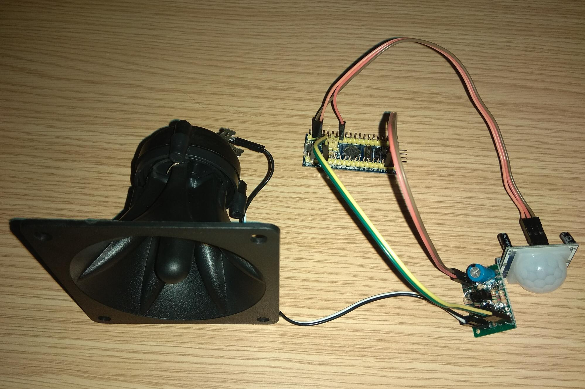

## Ultrasonic marten repeller based on the blue pill board (STM32F103C8T6).

#### Idea

Device emits sounds of natural marten enemy, at example badger. Rating of samples was extended to 88,2kHz and sound was moved in frequency scale to higher rate, to be less annoying for humans. The sound starts in audible range and reaches ultrasound.

#### Software 

Main worker is a Player structure with the set of related functions. It uses the Timer 1 to generate complementary PWM. Additional the Timer 6 is going to be used for better synchronization of the original sampling rate of samples (currently the rate is only rough).
Rest of job is done in main loop.  

Helper pins manipulating macros and declarations (gpio.h and bb.h) comes from ebook __Poradnik STM32 v1_9.pdf, autor: Szczywronek__.

#### Hardware 

The heart of device is the blue pill board (STM32F103C8T6). Folowing things are connected to the board 
- H-bridge with piezoelectric speaker. Pins PB13, PA8
- motion detector, PB0

The prototype features a simple bridge based on complementary bipolar transistors, controlled by open drain outputs. It is powered from 5V. Higher voltage also should works and extends range of sounds.No filtering has been implemented on the prototype. 
Ultimately, it is better to use MOS transistors with low Ron to better use the source of power.

